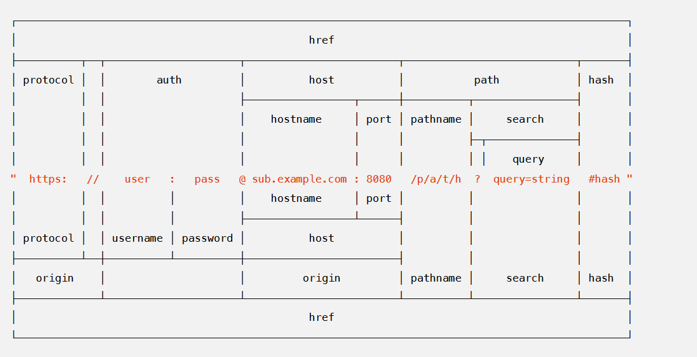

## URL

> The `url` module provides utilities for URL resolution and parsing. It can be accessed using:

```js
const url = require('url');
```

url 统一资源定位符。


### URL Strings and URL Objects

> A URL string is a structured string containing multiple meaningful components. When parsed, a URL object is returned containing properties for each of these components.

> The url module provides two APIs for working with URLs: a legacy API that is Node.js specific, and a newer API that implements the same WHATWG URL Standard used by web browsers.


