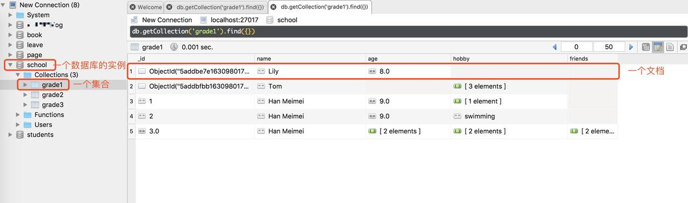

## Express

### `express` 框架

Express 是基于 node.js 的 web 开发框架。有点是易上手、高性能、扩展性强。

Express 其实是在 Node 内置的 HTTP 模块上构建了一层抽象。理论上所有 Express 实现的功能，同样可以使用纯 Node 实现。

总的来说，Express 提供了 4 个主要特性：

+ 与纯 Node 中使用一个函数处理所有请求的代码不同，Express 使用 "中间件栈" 处理流

+ 路由与中间件类似，只有当你通过特定 HTTP 方法访问特定 URL 时才会触发处理函数的调用

+ 对 `request` 和 `response` 对象方法进行了扩展

+ 视图模块允许你动态渲染和改变 HTML 内容，并且使用其他语言编写 HTML


#### 核心概念简介

express 主要包含三个核心概念：路由、中间件、模板引擎

+ `中间件`：不夸张的讲，在 express 应用中，一切皆中间件。各种应用逻辑，如：cookie解析、会话处理、日志记录、权限校验等，都是通过中间件来完成的

+ `路由`：地球人都知道，负责寻址的。比如用户发送了个 http 请求，该定位到哪个资源，就是路由说了算

+ `模板引擎`：负责视图动态渲染


### 通过 `express` 框架书写 API

    **什么是 API ?**

    + ajax  2007.8

      前端通过 ajax 请求数据

      ```js
      $.get('http://www.baidu.com/user/login?us=123&pass=456', () => {
          // do something...
      });
      ```

      API接口： `http://www.baidu.com/user/login?us=123&pass=456`  

      前后端分离：    
      前端：1.写界面  2.请求数据  3.数据处理
      后端：写 API 接口

      API接口构成要素：
        protocol + ip + port + pathname + method（get / post）+ parameters  


### 非关系数据库（文档） MongoDB

#### MongoDB 安装

参考地址：

+ [https://www.mongodb.com/what-is-mongodb](https://www.mongodb.com/what-is-mongodb)

+ [https://blog.csdn.net/qq_39377418/article/details/102870295](https://blog.csdn.net/qq_39377418/article/details/102870295)

#### MongoDB 基本概念

+ `数据库`  MongoDB 的单个实例可以容纳多个独立的数据库，比如一个学生管理系统就可以对应一个数据库实例

+ `集合`  数据库是由集合组成的，一个集合用来表示一个实体，如学生集合

+ `文档`  集合是由文档组成的，一个文档表示一条记录，比如一位同学张三就是一个文档

对应关系如下图：



#### 数据库操作

##### 1. 查看所有数据库

```shell
show dbs
```

返回如下：

```shell
> show dbs
admin   0.000GB
config  0.000GB
local   0.000GB
```

##### 2. 使用数据库

实例：切换到 school 数据库下

```shell
use school
```

> **注意：**如果此数据库存在，则切换到此数据库下；如果此数据库还不存在，也可以切换过来


参考文档：

[https://juejin.im/post/5add9e655188256735642122#heading-21](https://juejin.im/post/5add9e655188256735642122#heading-21)

[https://juejin.im/entry/5a01b482f265da43265241ee](https://juejin.im/entry/5a01b482f265da43265241ee)

