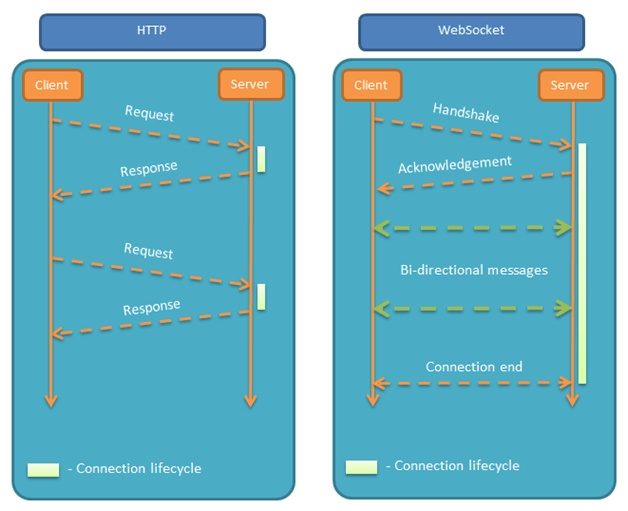

# WebSocket

WebSocket 协议是基于 TCP 的一种新的网络协议。它实现了浏览器与服务器全双工（full-duplex）通信——允许服务器主动发送消息给客户端。

特点：服务器可以主动向客户推送信息，客户端也可以主动向服务器发送信息，是真正的双向平等会话，属于服务器推送技术的一种。



其他特点：

+ 建立在 TCP 协议之上，服务端的实现比较容易

+ 与 HTTP 协议有着良好的兼容性。默认端口也是 80 和 443，并且握手阶段采用 HTTP 协议，因此握手时不容易屏蔽，能通过各种 HTTP 代理服务器

+ 数据格式比较轻量，性能开销小，通信高效

+ 可以发送文本，也可以发送二进制数据

+ 没有同源限制，客户端可以与任意服务器通信

+ 协议标识是 `ws`（如果加密协议，则为 `wss`），服务器网址就是 URL

```ini
ws://example.com:80/some/path
```

## 什么时候使用长连接 socket

- 实时刷新（轮询）

- 服务器端发起数据（服务器推送）

    + 会员到期提醒

    + 站内信

    + 中奖（真正）

## 实现 socket 的方式

- net

- socket.io  实现稍复杂，兼容性最好

- websocket  HTML5新增，低版本浏览器不能兼容，实现简单

### 前端后端 连接

1. 搭建 socket 服务器

```js
const webs = new WebSocket.Server({port: 3050}, () => { 
    //... 
});

webs.on('connection', (ws) => {

    ws.on('message', (message) => {
        // ...
    });

    ws.send(`something...`);

});

```

2. 前端进行连接

```js
// 脚本代码
new WebSocket('ws://localhost:3050')

ws.onOpen()
```

### 数据交互

```js
client.on('message', () => {
    // ...
});
```

3. 前端主动发送数据

4. 后端主动发送数据

```js
ws.onmessage = () => {
    // ...
};

ws.send();
```

### 前后端断开的处理

```js
ws.on('close')

ws.onClose()
```

5. 断开连接