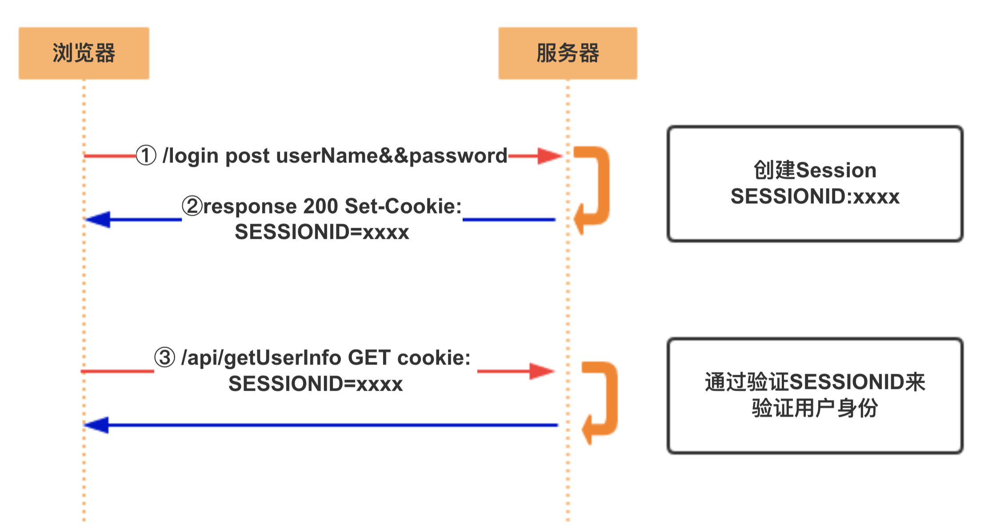

# Cookie 和 Session

`HTTP` 是一个无状态的协议。简单的说，当你浏览了一个页面，然后跳转到同一网站的另一个页面，服务器无法识别到这是同一浏览器（或者说同一个用户）在访问同一个网站；也就是说，服务器无法识别两条 http 请求是否是同一个用户发送的。即：服务器端并没有记录通信状态的能力。

为了用户体验，需要让服务器能够记忆用户的一些信息，cookie 便应运而生了。

## Cookie 

> HTTP Cookie（Web Cookie 或 浏览器 Cookie）是服务器发送到用户浏览器并保存在本地的一小块数据，它会在浏览器下次向同一服务器再发起请求时被携带并发送到服务器上。通常，它用于告知服务端两个请求是否来自同一浏览器，如保持用户的登录状态。Cookie使基于 `无状态` 的 HTTP 协议记录稳定的状态信息成为可能。

Cookie 主要用于以下三个方面：

    - 会话状态管理（如用户登录状态、购物车、游戏分数或其他需要记录的信息）

    - 个性化设置（如用户自定义设置、主题等）

    - 浏览器行为跟踪（若跟踪分析用户行为登录）

当访问一个页面的时候，服务器在下行 http 报文中，命令浏览器存储一个字符串；浏览器再访问同一个域的时候，把这个字符串携带到上行 http 请求中。

第一次访问第一个服务器，不可能携带 cookie。必须是服务器得到这次请求，在下行响应报头中，携带 cookie 信息，此后每一次浏览器往这个服务器发出的请求，都会携带这个 cookie。

cookie 的特点：

    - cookie 是不加密的，用户可以自由看到

    - 用户可以删除 cookie 或者禁用它

    - cookie 可以被篡改

    - cookie 可以用于攻击

    - cookie 存储容量很小，大于 4kb左右

### express 使用 `cookie-parser` 模块作为 cookie 解析的中间件

```js
const express = require('express');
const cookieParser = require('cookie-parser');

const app = express();

// 不使用签名
app.use(cookieParser());

// 如果需要使用签名，需要指定一个 secret, 字符串， 否则会报错
// app.use(cookieParser('aassddffgghhjjkkll'));


/// API说明
// 设置 cookie, value：类型为 String 和 Object; 
// 如果是 Object 会在 cookie.serialize() 之前自动调用 JSON.stringify 对其进行处理
// res.cookie(key, value, options)
//
// 清除 cookie
// res.clearCookie(name, options)

app.get('/user/login', (req, res) => {
    // 首次访问 Prints：[Object: null prototype] {}
    console.log(req.cookies);

    const options = {
        // Specifies the value for the Domain Set-Cookie attribute. 
        // 类型：String  在什么域名下有效，默认为网站域名
        domain: '',
        // Specifies the value for the Path Set-Cookie attribute.
        // 类型：String  在什么路径下有效，默认为 '/'
        path: '/user',
        // Specifies the Date object to be the value for the Expires Set-Cookie attribute. 
        // 类型：Date  cookie过期时间；如果没有设置或设置为0，那么这个cookie只在当前会话期间有效，
        // 关闭浏览器后，这个cookie会被浏览器删除
        expires: new Date(Date.now() + 900000),
        // Specifies the boolean value for the Secure Set-Cookie attribute. 
        // 类型：Boolean  只能被 HTTPS 使用，默认为 false
        secure: false,
        // Specifies the boolean value for the HttpOnly Set-Cookie attribute. 
        // 类型：Boolean  只能被 web server 访问
        httpOnly: true,
        // Specifies the number (in seconds) to be the value for the Max-Age Set-Cookie attribute. 
        // 类型：Number  实现expires的功能，设置cookie过期的时间，指明从现在开始，多少毫秒以后，cookie到期
        maxAge: 14 * 86400 * 1000,
        // Specifies the boolean or string to be the value for the SameSite Set-Cookie attribute.
        // `true` will set the SameSite attribute to Strict for strict same site enforcement.
        // `false` will not set the SameSite attribute.
        // `lax`  will set the SameSite attribute to Lax for lax same site enforcement.
        // 'none' will set the SameSite attribute to None for an explicit cross-site cookie.
        // 'strict' will set the SameSite attribute to Strict for strict same site enforcement.
        // 注意：该属性还未成为标准，未来可能会有变化；所以一般我们可忽略不进行设置
        sameSite: false,
        // 使用签名
        // 类型：Boolean  默认为 false；
        // express会使用req.secret来完成签名，需要cookie-parser配合使用
        signed: false
    };
    
    // 设置cookies
    res.cookie('islogin', 'true', options);
    res.cookie('cart', { items: [1, 2, 3] });
    res.cookie('busines_list', { 
        items: [
            { name: 'openAccount', code: 'oa' },
            { name: 'openHGT', code: 'hgt' }
        ] 
    }, { maxAge: 800000 });

    res.send(`❤ Login OK ❤`);
});

// app.get('/user/login', (req, res) => {
//     console.log('cookies', req.cookies);
//     console.log('signedCookies', req.signedCookies);
//     if (req.signedCookies.islogin === 'true') {
//         res.send('欢迎回来');
//     } else {
//         console.log('设置singed cookie');
//         res.cookie('islogin', 'true', { maxAge: 14 * 86400 * 1000, signed: true });
//         res.send(`模拟登录成功`);
//     }
// });

app.listen(3050, () => {
    console.log(`Listening on *:3050`);
});
```

## Session

Session 是另一种记录客户状态的机制，不同的是 Cookie 保存在客户端浏览器中，而 Session 保存在服务器上。客户端浏览器访问服务器的时候，服务器把客户端信息以某种形式记录在服务器上（Redis, MongoDB 等），这就是 Session。客户端浏览器再次访问时，只需要从该 Session 中查找该客户的状态就可以了。每个用户访问服务器都会建立一个 session 并自动分配一个 sessionId，用于标识用户的唯一身份。

### 需要清楚的几个问题

#### 1. 如何在每次请求时都把 SessionId 自动带到服务器？

通过 cookie 携带给服务器；如果你想为用户建立一次会话，可以在用户授权成功时返回一个唯一的 cookie。当一个用户再次发起请求时，浏览器会将用户的 SessionId 自动附加在 HTTP 头信息中（这是浏览器的自动功能，用户不会察觉到，开发人员也不需要操作），当服务器处理完扯个请求后，将结果返回给 SessionId 所对应的用户。

#### 2. 存储需要的信息

服务器通过 SessionId 作为 key，读写对应的 value，这就达到了保持会话信息的目的。

#### 3. Session 依赖于 cookie，如果禁用了 cookie，如何实现 session ?

如果客户端禁用了 cookie, 通常有两种方法实现 session 而不依赖 cookie：

    + URL重写；就是把 sessionId 直接附加在 URL 路径的后面

    + 表单隐藏域；服务器会自动修改表单，添加一个隐藏字段，以便在表单提交时能够把 sessionId 传回服务器。

    ```html
    <!-- 举个栗子 -->
    <form name="walking-form" action="/xxx/xxx">
        <input type="hidden" name="JSessionId" value="NawoW3vjFw98aKns2CHjmdnV9lzCebWoeI89ndemkd!-142993499" />
        <input type="text" />
    </form>
    ```

### Session 的创建

当程序需要为某个客户端的请求创建一个 session 时，服务器首先检查这个客户端请求里是否已包含了 sessionId，如果已包含则说明以前已经为此客户端创建过 session，服务器就按照 sessionId 把这个 session 检索出来使用（检索不到，会新建一个），如果客户端请求不包含 sessionId，则为此客户端建一个 session 并且生成一个与此 session 相关联的 sessionId， sessionId 的值是一个既不会重复，又不容易被找到规律以仿造的字符串，这个 sessionId 将被在本次响应中返回给客户端保存。



+ 1.用户向服务器发送用户名和密码

+ 2.服务器验证通过后，在当前对话（session）里面保存相关数据，比如用户角色、登录时间等等

+ 3.服务器向用户返回一个 `sessionId`，写入用户的 `cookie`

+ 4.用户随后的每一次请求，都会通过 `cookie` 将 `sessionId` 传回服务器

+ 5.服务端收到 `sessionId`，找到前期保存的数据，由此得知用户的身份

### express 使用 `express-session` 模块作为来处理 session 的中间件

